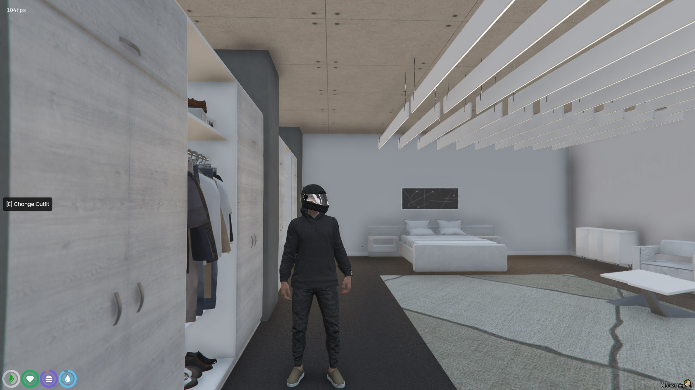
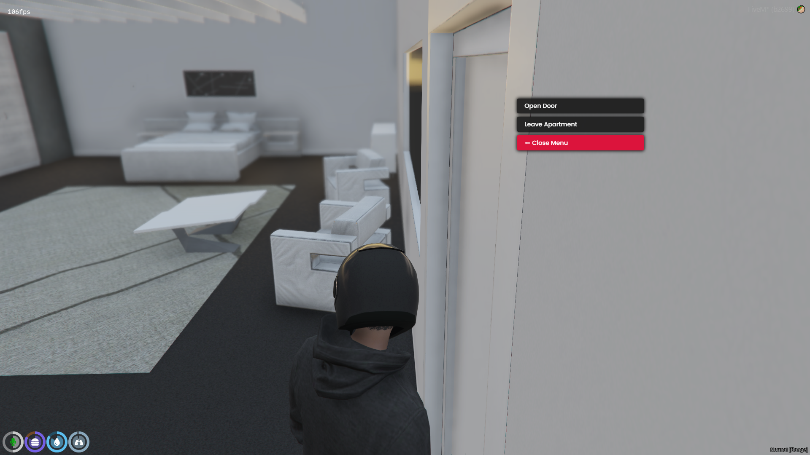

# qb-interior-modern
qb-interiors but using modern apartments

Credits go to qb this is only a edit by myself. Polo Enjoy :)

qb-interior
Shells provided by K4MB1

https://www.k4mb1maps.com/

https://discord.gg/JrjkacM

https://discord.gg/qbcore

QBCore Framework
Copyright (C) 2021 Joshua Eger

This program is free software: you can redistribute it and/or modify
it under the terms of the GNU General Public License as published by
the Free Software Foundation, either version 3 of the License, or
(at your option) any later version.

This program is distributed in the hope that it will be useful,
but WITHOUT ANY WARRANTY; without even the implied warranty of
MERCHANTABILITY or FITNESS FOR A PARTICULAR PURPOSE.  See the
GNU General Public License for more details.

You should have received a copy of the GNU General Public License
along with this program.  If not, see <https://www.gnu.org/licenses/>
